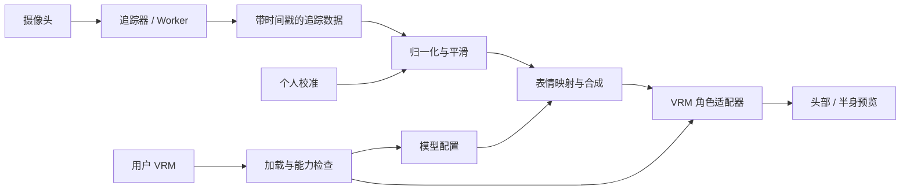
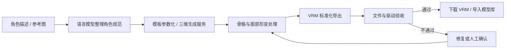

# AR-Capture 项目计划

- 文档日期：2026-09-28
- 文档版本：1.1（2026-09-30 更新实施状态，原计划由 Git 保留）
- 当前阶段：V1 工程预览版已实现；自动化与浏览器链路验证完成，真实摄像头及人员实验尚待验收。
- 项目仓库：AniMirror（早期开发名称 AR-Capture）
- 本文约定：下文验收数值仍为目标；只有 `progress/` 与 GitHub Actions 中明确记录的项目代表已验证，不将自动化结果泛化为真实设备质量。

## 实施状态（2026-09-30）

V1-01 至 V1-14 的工程入口及核心模块已实现：两代 VRM 导入/报告/预览、Worker 本地面捕、相机生命周期、具名映射与试动、个人校准与角色调节、平滑恢复、配置存储、参数录制回放、自然/增强及简洁模式。

- 三份原创 CC0 诊断模型覆盖 VRM0/VRM1、丰富/缺失表情；不代替成品动漫模型验收。
- 本地 Edge 已验证真实 Worker/WASM 启动、模拟摄像头关闭、模型恢复等流程；静态真人照片的实际模型推理已返回有效具名数据。照片未提交。
- 自动化命令及使用说明见 [README](../README.md)，远程结果见 [GitHub Actions](https://github.com/epiconfuison/AniMirror/actions)。M0/M4 中的真人质量与持续性能门槛仍待实际验证。
- 使用说明见根目录 `README.md`；每阶段独立文件夹见 `progress/`；按功能 Git 保存。
- 原定后续生成 VRM、AR 替换等路线保持延后。

## 1. 项目目标与首版交付

建设一个支持用户自带动漫角色模型的面部表情驱动工具：用普通摄像头捕捉一人的头部动作和面部动作，在本机驱动三维动漫角色，重点显示头部或半身。

V1 的完整使用闭环：

> 导入 .vrm → 检查模型能力 → 确认表情映射 → 开启摄像头 → 完成个人校准 → 实时驱动角色 → 保存配置 → 再次导入时恢复配置。

首版的三项核心贡献：

1. **模型适配**：面对不同模型的表情命名、通道数量和形变幅度，提供能力报告、映射建议和可视化修正。
2. **双层校准**：人的面部动作范围与角色的形变范围分别配置，换模型时无需重新学习用户的面部幅度。
3. **稳定驱动**：在减少抖动的同时保留眨眼、快速张嘴等动作，正确处理短暂遮挡和追踪恢复。

XR Animator 已支持摄像头追踪、自定义 VRM/MMD 和 Perfect Sync，因此以上基础能力不作为本项目独创点。将其作为功能与体验对照，独立设计接入、校准和配置模块；具体源码复用须记录文件来源、版本和改动。[XR Animator 功能与许可](https://github.com/ButzYung/SystemAnimatorOnline)

## 2. 默认条件与边界

| 项目 | 首版决定 |
|---|---|
| 使用平台 | 优先在用户的 Windows 电脑上开发和验收，支持 Chrome、Edge 当前稳定版 |
| 应用形式 | 本地运行的 Web 应用，通过 localhost 打开；暂不制作安装包 |
| 摄像头 | 普通 RGB 摄像头；单人、正面至小角度转头 |
| 输入模型 | .vrm；VRM 1.0 为主，VRM 0.x 通过版本适配层兼容并单独测试 |
| 展示方式 | 导入完整人形模型，显示头部或半身；首版不要求只含头部的非标准资产 |
| 计算位置 | 摄像头推理、配置和渲染在浏览器本地进行 |
| 初始资源 | 准备至少 3 个来源和使用许可明确的测试模型，包括 0.x、1.0、丰富表情及缺失通道场景 |
| 云端与账号 | V1 不依赖账号、后端服务或付费 API |
| 模型制作 | V1 使用现成模型，不负责自动建模、补骨骼或生成缺失面部形变 |

开发启动时在 M0 记录真实的参考电脑 CPU/GPU、浏览器版本、摄像头与测试模型规模。本文的性能目标按这台参考机验收，不能泛化为所有设备都能达到。

“丰富表情”取决于模型具备的形变。追踪器输出 52 项系数不代表每个 VRM 都有 52 个有效控制通道；MediaPipe 与 ARKit 的参数集合也不应按数组位置直接等同。应按命名、语义和模型能力建立映射。[MediaPipe 输出说明](https://developers.google.com/edge/mediapipe/solutions/vision/face_landmarker)

## 3. V1 功能范围

P0 为首版必须完成；P1 为首版优化项，不能阻塞 P0 闭环。

| 编号 | 优先级 | 功能 | 交付及验收要点 |
|---|---|---|---|
| V1-01 | P0 | 模型导入与替换 | 文件选择、拖拽导入 .vrm；显示进度和错误；新模型加载成功后再释放旧模型 |
| V1-02 | P0 | 模型能力检查 | 识别 VRM 版本、头部和眼睛骨骼、预设/自定义表情、可用形变；区分不支持、待确认映射、可驱动 |
| V1-03 | P0 | 头部/半身预览 | 自动取景，支持缩放、旋转、背景色和重置视角；检查材质、眼睛及头发是否正常 |
| V1-04 | P0 | 摄像头控制 | 选择设备、启动、暂停追踪、关闭摄像头；处理拒绝权限、设备占用、拔出和无设备 |
| V1-05 | P0 | 面部追踪 | 输出带时间戳的头部姿态及具名表情系数；一次仅追踪一人；显示已识别/未识别状态 |
| V1-06 | P0 | 基础表情驱动 | 头部三轴转动、左右眨眼、张嘴、微笑；眼神、眉毛和细分嘴型按模型能力启用 |
| V1-07 | P0 | 半自动映射 | 标准名/别名匹配，手动选择目标，支持一个输入控制多个目标及简单加权合成；可逐通道试动和重置 |
| V1-08 | P0 | 个人校准 | 中性脸、闭眼、张嘴、微笑，按需增加抬眉；保存个人基线和幅度；无效步骤可重试或跳过非必需项 |
| V1-09 | P0 | 角色侧调节 | 独立设置通道增益、死区、上下限、响应曲线及头部转动范围；防止过度形变 |
| V1-10 | P0 | 平滑与恢复 | 自适应平滑、时间戳驱动、丢帧只取最新结果；人脸丢失后短暂保持并回正，恢复时渐变 |
| V1-11 | P0 | 配置保存 | 分别保存个人校准、模型映射和界面设置；本地恢复及 JSON 导入/导出；验证版本和目标模型 |
| V1-12 | P0 | 诊断与评估 | 显示渲染帧率、推理耗时、通道值及缺失项；开发模式支持短段参数录制与确定性回放 |
| V1-13 | P1 | 风格预设 | 提供“自然”和“增强”两套参数配置；只调整已有通道，不生成新模型形变 |
| V1-14 | P1 | 简洁展示模式 | 隐藏控制区、调整背景及角色构图，方便使用现有屏幕录制工具 |

### 3.1 模型能力分级

- **基础可用**：可加载和显示，存在可驱动头部骨骼；缺少表情时清楚提示限制。
- **基础面捕可用**：具备眨眼、张嘴等通道，可执行对应动作。
- **丰富面捕可用**：具备更多眉毛、嘴角、眼睑等独立形变，经映射测试后可进行细粒度控制。
- 不以扩展名或自称支持 Perfect Sync 作为唯一依据；导入后检查实际数据。
- 无法驱动的通道可以禁用或由用户选择近似映射；近似方案要标明，不能静默伪装为完整支持。

### 3.2 映射与驱动规则

- 以“输入通道 → 归一化与曲线 → 目标表情/骨骼”建立配置。
- 统一到内部语义后再适配 VRM 版本。例如 VRM0 的 joy 与 VRM1 的 happy、a 与 aa 等不直接混用。[VRM 表情规范](https://vrm.dev/en/vrm1/expression/)
- 头部姿态以校准的正面为参考；同时检查轴向、左右、镜像和相机坐标转换。
- 镜像预览与数据左右语义分离，避免左右眼映射反转。
- 每个目标每帧由合成器写入一次；基础追踪、手动试动、风格预设有明确优先级。
- 遵守模型的眨眼、口型和视线覆盖规则，避免微笑表达式与眨眼相互争夺。
- 默认通过 VRM 表情接口控制；需要直接访问底层 Morph Target 的特殊模型，使用专门目标适配器且禁止双重写入。
- 首版嘴型源于视觉几何和形变系数，不把它描述为语音识别或精确音素识别。

### 3.3 首版明确延后

以下功能保留到后续版本：通用 GLB/FBX/MMD/Live2D 导入、自动补面部形变、全身/手部/多人追踪、真实画面头部替换、复杂动漫特效、音频口型、视频导出、虚拟摄像头、VMC/OSC 集成、桌面安装包、云模型库，以及通过 API 调用大模型生成 VRM。

首版不增加不可用的“AI 生成”按钮，也不建立空的付费 API 后端。

## 4. 用户流程与界面

主界面以角色预览为中心，模型/摄像头入口和调节面板放在两侧；高级诊断默认收起。

1. **导入模型**：出现模型预览和能力检查结果；失败时说明原因并保留当前可用模型。
2. **确认映射**：自动建议基础映射；用户点击“测试眨眼/张嘴”等检查效果，必要时手动调整。
3. **开启摄像头**：用户明确启动后请求浏览器权限；可以显示或隐藏摄像头预览。
4. **引导校准**：按步骤采集中性脸和动作范围；只有检测到有效人脸才采样，动作不足时允许重试。
5. **实时驱动**：常用控制为校准、表情强度、平滑、暂停和关闭摄像头。
6. **保存与复用**：配置绑定模型文件哈希；再次选择同一个模型时自动匹配。模型文件本身在 V1 默认不持久保存，刷新后可重新选择。
7. **异常恢复**：摄像头失效可重新选择；跟踪丢失进入自然回正；配置损坏可恢复默认而不阻止使用。

“暂停追踪”保留摄像头连接并明确显示状态；“关闭摄像头”必须停止媒体轨道、推理循环和相关资源。

## 5. 技术方案与模块边界

### 5.1 建议技术栈

| 层次 | 建议 | 选择理由 |
|---|---|---|
| 界面 | TypeScript + React + Vite | 方便制作导入、校准和映射编辑界面 |
| 角色渲染 | Three.js + @pixiv/three-vrm，优先 WebGL | 利用标准 VRM 加载和表情接口，先保证兼容性 |
| 面部追踪 | @mediapipe/tasks-vision 的 Face Landmarker | 获取面部关键点、表情系数和变换矩阵 |
| 实时调度 | 独立渲染循环 + 推理 Worker | 避免推理阻塞交互，只处理最新帧 |
| 配置存储 | IndexedDB + 带 schemaVersion 的 JSON | 保存多个模型配置和个人校准，支持迁移 |
| 验证工具 | Vitest、Playwright、真实摄像头人工验收 | 分别验证映射逻辑、用户流程和真实视觉体验 |

在 M0 锁定一组经过验证的依赖版本并提交锁文件；不在设计阶段假定所有最新版本天然兼容。three-vrm 的加载方式与许可见[官方仓库](https://github.com/pixiv/three-vrm)。

MediaPipe 的 Web 检测调用会同步阻塞调用线程，官方建议用 Worker 隔离。[Web 集成说明](https://developers.google.com/edge/mediapipe/solutions/vision/face_landmarker/web_js)

### 5.2 运行链路



模型加载、追踪和映射互相独立，UI 不直接修改模型网格。配置变化通过控制层传入，逐帧数据避免触发整个 React 界面重新渲染。

若 Worker 与所选 GPU 路径存在兼容问题，先验证 Worker CPU 路径并降低推理尺寸/频率；不能无提示地让推理持续阻塞界面。此项是 M0 的技术验证内容。

### 5.3 首版实际需要的数据契约

| 数据结构 | 关键内容 | 用途 |
|---|---|---|
| TrackingFrame | schemaVersion、时间戳、有效人脸状态、头部旋转、具名表情系数、可选关键点 | 解耦追踪器与模型；供回放使用 |
| AvatarCapabilities | VRM 版本、可用骨骼、预设/自定义表情、形变目标、缺失项 | 生成能力报告及映射建议 |
| ModelProfile | modelHash、schemaVersion、输入目标映射、曲线、限制、眼神模式 | 保存每个模型的配置 |
| UserCalibration | profileId、schemaVersion、中性值、动作范围、采样质量、时间 | 与模型分离，支持重新校准 |
| AvatarAsset | assetId、文件引用、format、source、名称、可选来源与许可信息 | 当前 source 为 local；将来可接 generated |

不将 blendshape 分数当成追踪置信度。追踪质量应来自实际可获得的有效检测状态、关键点完整性、姿态合理性和数据时效性；缺少逐帧置信度时明确表示未知。

### 5.4 建议代码目录

以下结构已随 V1 工程实现创建，实际细分文件以源码为准。

```text
src/
  app/                 应用入口与界面状态
  features/
    model-import/      导入、能力检查、模型选择
    camera/            设备与权限
    calibration/       校准流程
    mapping-editor/    表情映射编辑
    preview/           角色预览与构图
    diagnostics/       性能及回放
  core/
    tracking/          追踪接口、MediaPipe 与 Worker
    avatar/            VRM 加载、版本及目标适配
    retargeting/       校准、平滑、映射、冲突合成
    profiles/          配置校验、存储、迁移
    contracts/         跨模块数据类型
public/
  tracking-assets/     固定版本的模型和 WASM 资源
tests/
  fixtures/            合法可分发的模型或获取说明、参数片段
docs/
  PROJECT_PLAN.md
```

### 5.5 本地数据与资源管理

- 运行期摄像头图像不上传；面捕模型和 WASM 使用固定的本地同源资源，避免运行时依赖第三方 CDN。
- 仅在用户主动录制诊断数据时保存短段参数；V1 不记录原始视频。
- 配置可单独导出和清除；避免把个人信息写入公开日志。
- 导入校验文件头、必要扩展、资源规模及外部引用；不能只检查后缀。先设单文件 100 MB 上限，M0 根据样例调整并记录。
- 本地 VRM 的外部资源请求默认拒绝，错误信息说明如何改为自包含文件。
- 切换角色、摄像头或退出时释放 WebGL 资源、对象 URL、媒体轨道和 Worker。
- 初始化下载体积、失败提示及资源版本写入使用说明。

## 6. V1 验收标准

下列数值是初始工程目标。M0 先完成参考机与样例基线，记录任何目标调整及原因；不能在最终验收时通过临时换设备或改阈值隐藏问题。

| 类别 | 验收方式与目标 |
|---|---|
| 模型兼容 | 至少 3 个合规样例覆盖 VRM0/VRM1、基础/丰富形变；全部按能力正确驱动；缺少通道明确报告且不崩溃 |
| 导入恢复 | 损坏文件、超限文件、缺少必要结构均能解释失败原因；切换失败保留上一角色 |
| 配置持久化 | 同文件哈希重新导入可恢复映射；用户校准与模型配置独立；错误版本/损坏配置可回退 |
| 基础动作 | 对具有对应通道的样例，转头、点头、歪头、左右眨眼、张嘴、微笑方向正确；没有左右翻转和持续形变冲突 |
| 重复动作 | 参考条件下由至少 3 名测试者各做 20 次眨眼、张嘴、微笑，校准后每人每项成功率目标 ≥90%；逐人记录失败，不只报平均值 |
| 中性状态 | 每人保持自然中性脸 60 秒，明显的错误闭眼/张嘴/微笑触发目标 ≤2 次；正常自然眨眼不记为错误 |
| 配置耗时 | 命名规范且能力完整的样例，导入到基础驱动目标 ≤3 分钟，含校准；非标准模型单独记录，不承诺同一时限 |
| 实时性能 | 参考机、单人、摄像头 720p 输入且可缩小推理图像：稳定渲染 ≥30 FPS，目标 60；推理吞吐目标 ≥20 FPS |
| 处理延迟 | 从帧送入应用处理到驱动渲染提交的 P95 目标 ≤100 ms；这不是传感器到屏幕的端到端延迟 |
| 稳定性改进 | 同一静止参数片段回放，自适应方案较无平滑基线的输出抖动 RMS 目标降低 ≥30%；另报眨眼漏检和响应延迟，避免靠过度平滑达标 |
| 追踪恢复 | 遮挡 2 秒再恢复正面，目标 1 秒内重新稳定驱动；恢复期间无明显姿态跳变 |
| 持续运行 | 连续 30 分钟并切换模型/摄像头各 10 次，无崩溃、重复推理循环或持续资源累积；保存浏览器性能记录 |
| 关闭与隐私 | 关闭摄像头后轨道停止；运行时网络检查无视频/人脸上传；删除配置后不自动恢复已删数据 |

动作成功/误触发的阈值与时间窗应在实验前固定并写入测试记录；与模型缺失能力相关的动作标注为不适用，不能计入成功率。

测试条件固定为单人、均匀室内光照、正面及约 ±30° 的小角度转头。眼镜、逆光、大侧脸作为边界场景记录表现，不把它们混入已验证的支持范围。

### 6.1 验证分层

- 单元测试集中验证有业务意义的行为：版本语义转换、校准归一化、边界钳制、冲突合成、丢帧恢复、配置迁移。
- 固定参数回放用于比较相同输入下的多个模型和算法；不能代替真实摄像头追踪质量测试。
- 浏览器自动化验证导入、配置持久化、损坏输入、权限错误及可模拟的视频流程。
- 真实摄像头与视觉检查验证材质、动作方向、表情自然程度和延迟。
- XR Animator 可在同设备、同模型和相似条件下做体验对照；独立记录版本、设置和方法，不将不同条件下的帧率直接比较。

## 7. 开发里程碑与任务顺序

按一名具备 TypeScript/Three.js 开发经验的开发者、已有合适测试模型估算：P0 约 19–27 个工作日；加入 20% 缓冲约 23–33 个工作日，即约 5–7 周。不是交付日期承诺；不包含从零制作角色或训练模型的时间。

| 里程碑 | 工作量估计 | 依赖 | 主要任务 | 阶段出口 |
|---|---:|---|---|---|
| M0 技术与资产验证 | 2–3 天 | 无 | 记录参考机；锁依赖；获得合规样例；验证两代 VRM、基础驱动、Worker 路径及本地资源 | 证明完整技术链路可行，列明样例能力和性能基线 |
| M1 导入与预览 | 3–4 天 | M0 | 实现 V1-01/02/03；资源释放与异常文件处理 | 可稳定切换并检查三类样例 |
| M2 摄像头与基础面捕 | 4–5 天 | M0；联调需 M1 | 实现 V1-04/05/06；姿态坐标、左右语义、追踪状态 | 标准样例可连续跟随基本动作 |
| M3 映射、校准和配置 | 5–7 天 | M1、M2 | 实现 V1-07/08/09/11；两代版本适配与冲突规则 | 换模型后能修正并保存配置，个人校准可复用 |
| M4 稳定性与验收 | 4–6 天 | M3 | 实现 V1-10/12；固定输入对照；真实摄像头和性能验收 | P0 验收记录完整，阻断缺陷关闭 |
| M5 交付整理 | 1–2 天 | M4 | 构建产物、启动说明、模型要求、操作演示、已知限制、来源清单 | 新环境可按说明启动并完成闭环 |

M1 的导入/预览与 M2 的追踪器原型可在数据契约明确后并行；先做接口再集成。P1 在 M4 后按剩余时间决定，不挤占验收。

### 7.1 首轮实施清单

1. 初始化工程、版本管理及开发命令；建立依赖锁文件。
2. 建立 TrackingFrame、AvatarCapabilities、ModelProfile 和 UserCalibration 类型。
3. 准备模型样例清单，记录版本、表情能力和使用权限。
4. 完成一个 VRM1 丰富表情样例的“摄像头 → 张嘴/眨眼/头部”技术验证。
5. 用 VRM0 样例验证版本适配与坐标，再验证缺少通道的样例。
6. 验证本地资源和 Worker 调度后进入完整功能开发。

### 7.2 首版交付清单

- 可运行源码、锁文件、开发及构建命令。
- 本地可运行的构建产物与启动说明。
- 模型导入和表情能力要求说明。
- 校准与映射操作说明、配置格式与样例。
- 验收记录、性能基线、已知限制。
- 合规测试素材或明确的获取步骤。
- 第三方依赖、素材及源码复用来源清单。
- 本计划更新为真实完成状态，后续功能继续保留在路线图中。

## 8. 后续版本路线

版本名称表示建议顺序；V1 验收后可调整 V2–V4 的顺序。AI 生成功能依赖合格的模型接入/校验能力，不依赖先完成 AR 头部替换。

| 版本 | 目标 | 保留功能 | 进入条件 |
|---|---|---|---|
| V1.1 | 首版稳定与使用便利 | 更多 VRM 样例、复杂光照/眼镜调优、模型本地库、更多风格预设、可选桌面包装 | V1 已交付，有真实使用反馈 |
| V2 | 表现力与接入扩展 | 动漫表情规则编辑、腮红/汗滴等效果、视听口型融合、通用 GLB 映射；评估 MMD/Live2D 独立适配器；录制与外部输出 | 核心映射稳定，各新增适配器独立验收 |
| V3 | AR 动漫头部替换 | 保留真人身体与背景，头部定位与缩放、颈部衔接、遮挡、手挡脸及分割 | 摄像头和姿态稳定；单独验证合成/遮挡质量 |
| V4 | API 辅助生成 VRM | 角色描述/参考图、生成服务接入、异步任务、绑定与表情处理、VRM 导出、校验并导入 | 完成生成路线 PoC、成本评估和合格资产标准 |

全身/手部/多人追踪、云端社区和跨设备协作保留为长期探索，尚不承诺版本与日期。

## 9. 后续重点：通过 API 调用大模型生成 .vrm

### 9.1 产品目标

用户输入角色描述，可选提供参考图片；系统通过 API 调用语言模型及必要的三维生成服务，最终给出可下载、可重新导入 AR-Capture 的 .vrm 文件。

最终成功标准是“可驱动的 VRM 角色”，仅得到一个能显示的网格、一个 GLB 或将后缀改为 .vrm 均不算完成。

已核实的候选服务中，Meshy 文生 3D API 输出 GLB、FBX 等格式，其自动绑定指南说明复杂面部绑定仍需在 DCC 工具中处理。因此这里采用分阶段生成管线，而不承诺任一供应商已直接提供完整面捕 VRM。[生成 API](https://docs.meshy.ai/en/api/text-to-3d)、[绑定能力边界](https://docs.meshy.ai/en/webapp/guides/3d-model/rigging)

本功能本期只保留设计：不接服务商、不索取 API Key、不调用收费接口、不训练模型、不开发生成后台。

### 9.2 两条实现路线

**路线 A：基于已绑定角色模板生成，优先做 PoC。**

角色描述 → 大模型生成受约束的角色参数 → 选择/修改具有标准骨骼和面部形变的模板 → 生成或替换许可允许的贴图与部件 → 导出 VRM → 验证 → 导入。

- 优点：骨骼与表情结构可以预先保证，更有希望稳定交付可面捕模型。
- 边界：外观自由度受模板、可用部件和导出工具限制；不能承诺任意角色都能生成。
- PoC 必须验证可自动调用的模板编辑与 VRM 导出工具，不能假定 VRoid Studio 提供现成的自动化 API。

**路线 B：自由生成三维角色，再完成动画资产处理，作为研究路线。**

角色描述/参考图 → 三维生成服务 → GLB/FBX 网格 → 拓扑与材质修复 → 人形骨骼绑定 → 面部形变制作或迁移 → VRM 标准化导出 → 验证 → 导入。

- 难点集中在脸部拓扑、眼球/口腔结构、蒙皮、面部形变及材质转换。
- 标准 VRM 是人形资产，包含规定的必需骨骼；只有头部的自由生成网格需要额外结构处理。优先生成完整人形资产，在应用中只展示头部。[人形骨骼规范](https://vrm.dev/en/vrm1/humanoid/)
- 可评估 UniVRM 作为导出工具；从 FBX 导出 VRM 仍需满足人形骨骼、姿态和角色配置要求。[官方导出流程](https://vrm.dev/en/univrm1/vrm1_tutorial/first_export_from_fbx/)
- 人体自动绑定与面部丰富表情绑定是不同能力，不能把“已绑定”当成已具备面捕表情。
- 转移形变通常要求拓扑对应、稳定的变形方法或模板约束，不能对任意网格承诺全自动成功。
- 允许返回“需要修复”的状态和人工修复路径，而不是把不合格资产当作成功结果。

### 9.3 生成流程与质量关卡



未来完成状态分层：

1. **preview_ready**：只有可预览网格，不能标记为完整 VRM 成功。
2. **needs_repair**：结构、绑定或表情不满足要求，附具体报告。
3. **ready**：文件符合约定的 VRM 版本，且通过产品规定的面捕动作验收。

“丰富表情生成”至少要验证左右眨眼、张嘴、嘴角变化和眉毛等规定的独立通道，以及组合时无明显穿插。目标通道集合应在该阶段固定，不以“包含 52 个名字”替代实际形变检查。

### 9.4 V1 只做的必要预留

| 边界 | V1 的实际工作 | 生成版本再做 |
|---|---|---|
| 模型来源 | AvatarAsset 使用 source 字段，当前仅 local | generated 来源、云端下载与历史任务 |
| 统一接入 | 所有资产经同一加载器、能力检查和配置入口 | 生成产物也走同一路径 |
| 配置演进 | 数据含 schemaVersion，可做迁移 | 保存生成参数、模型版本与来源追溯 |
| 能力报告 | 区分结构错误、缺失通道、可驱动范围 | 将其复用为自动生成验收的一部分 |
| 模块边界 | 模型接入不依赖摄像头或 UI | 接入生成后端和不同服务商 |

GenerationProvider 和任务 API 本期只在文档定义，不创建无人使用的后台或空实现。

### 9.5 后续服务接口草案

- CharacterSpec：角色风格、外观参数、参考图引用、目标 VRM 版本、目标表情集合。
- GenerationProvider：estimate、submit、getStatus、cancel、fetchArtifacts；取消能力按供应商实际能力处理。
- GenerationJob：jobId、provider、输入摘要、阶段、进度、费用上限、产物引用、错误和重试信息。
- 状态建议：draft → queued → generating → rigging → facial_setup → exporting → validating → ready；分支为 needs_repair、failed、cancelled。
- 采用异步任务与轮询/回调；支持幂等提交、断点恢复、超时和分阶段重试，避免重复计费。
- API Key 保存在后端；前端只调用自有服务，不将密钥写入页面或公开仓库。
- 付费任务提交前展示服务商、预算上限及将上传的内容，获得用户本次确认；普通面捕仍保持本地。
- 大模型只产出受校验的角色参数/任务描述，不直接执行其生成的任意脚本。
- 生成文件在隔离任务环境中校验结构、资源规模和引用；通过后才进入可下载模型库。
- 保存生成模型和素材的使用条件；具体服务商、价格、地区可用性与产物许可在启动该版本时重新核验。

## 10. 风险与处理

| 风险 | 影响 | 处理与决策点 |
|---|---|---|
| 模型缺少形变 | 无法达到丰富表情 | M0 确保至少一个合格丰富表情模型；缺失能力明确报告，建模工作单列 |
| VRM 两代差异与覆盖规则 | 口型/眨眼冲突或方向错误 | 统一语义、分版本样例、逐通道和组合动作回放 |
| 映射自动猜测错误 | 角色表情异常 | 映射建议可试动、可修正；不确定时要求用户确认目标 |
| 摄像头与光照变化 | 校准失效、追踪抖动 | 中性重校准、边界环境测试、丢失回正；不承诺全环境稳定 |
| 平滑过强 | 延迟和漏眨眼 | 同时验收抖动、响应延迟及动作成功率 |
| Worker/GPU/浏览器兼容 | 无法达到性能目标 | M0 验证路径，使用有记录的降级策略 |
| 资产或推理资源过大 | 加载失败、内存上升 | 文件限制、推理分辨率设置、资源释放与持续运行检查 |
| 直接复用 XR Animator 源码 | 影响发布与后续商业用途 | 仓库声明改编源码采用 CC BY-NC-SA 4.0；保留来源；商业路线需另行确认授权或独立实现 |
| 自由生成网格缺少面部绑定 | 生成 VRM 不能驱动 | 优先模板路线；自由生成路线设置修复关卡和人工出口 |
| 功能膨胀 | 首版不能闭环 | 按 P0 与里程碑交付，新需求进入后续路线图 |

XR Animator 的许可限制针对改编其源码；仓库另行说明该许可不适用于使用自身资产生成的视频内容。代码、模型和其他素材分别核对来源。[许可说明](https://github.com/ButzYung/SystemAnimatorOnline#copyrightlicensecredits)

## 11. 完成定义与变更原则

V1 完成需要同时满足：

- P0 功能全部完成并有可复现的验收记录。
- 至少三类样例通过模型能力对应的测试，真实摄像头闭环通过。
- 无阻止正常导入、关闭摄像头、校准、驱动或配置恢复的缺陷。
- 依赖、样例、复用源码和资源来源清楚。
- 使用说明足以在新环境启动；尚未支持的功能和已知限制明确。
- 生成 VRM 等后续功能继续保留在计划内，不以空按钮代替实现。

新需求先判断是否影响首版闭环；不影响的默认进入后续版本。若改变支持平台、模型格式或核心质量目标，同步更新范围、估时和验收标准。

## 12. 资料与后续核验

本文对现有工具能力的说明依据下列官方资料；架构、版本安排和验收数值是本项目的设计建议。

- [XR Animator 仓库](https://github.com/ButzYung/SystemAnimatorOnline)：功能基线、源码结构与许可。
- [MediaPipe Face Landmarker](https://developers.google.com/edge/mediapipe/solutions/vision/face_landmarker)：关键点、表情系数和变换矩阵。
- [MediaPipe Web 集成](https://developers.google.com/edge/mediapipe/solutions/vision/face_landmarker/web_js)：Web API、本地资源和 Worker 调度。
- [three-vrm](https://github.com/pixiv/three-vrm)：VRM 加载与渲染组件。
- [VRMExpressionManager](https://pixiv.github.io/three-vrm/docs/classes/three-vrm.VRMExpressionManager.html)：表情枚举、取值和设置接口。
- [VRM 1.0 表情规范](https://vrm.dev/en/vrm1/expression/)：版本语义与表情管理差异。
- [VRM 格式说明](https://vrm.dev/en/vrm/gltf/format/)：VRM 与 glTF/GLB 的关系。
- [Meshy 文生 3D API](https://docs.meshy.ai/en/api/text-to-3d)：候选生成服务的任务与产物格式。
- [Meshy 自动绑定指南](https://docs.meshy.ai/en/webapp/guides/3d-model/rigging)：自动骨骼绑定及面部绑定边界。
- [UniVRM 导出流程](https://vrm.dev/en/univrm1/vrm1_tutorial/first_export_from_fbx/)：从 FBX 准备并导出 VRM。
- [VRM 人形骨骼规范](https://vrm.dev/en/vrm1/humanoid/)：标准人形角色结构要求。
